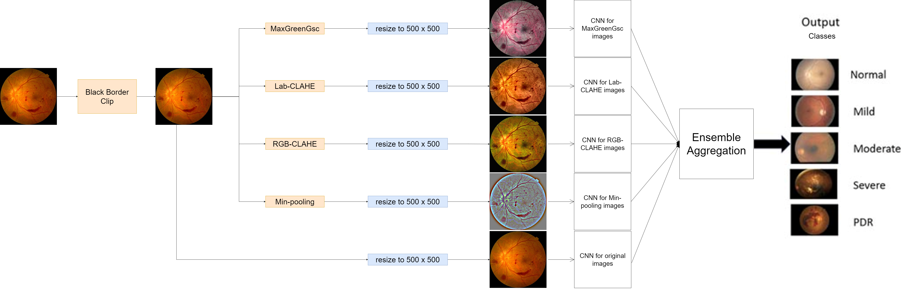

# Fundus Image Preprocessing Configuration for Ensemble Model

This repository implements the preprocessing pipeline described in the paper **"Image preprocessing-based ensemble deep learning classification of diabetic retinopathy"** ([IET Image Processing, 2024](https://ietresearch.onlinelibrary.wiley.com/doi/full/10.1049/ipr2.12987)).

## Overview

The preprocessing system takes a single fundus image with arbitrary resolution and generates **5 variants** through a systematic preprocessing pipeline:

1. **Black Border Clipping** - Applied to the original image first
2. **Five Image Variants** generated from the clipped image:
   - Original clipped image (baseline)
   - RGB-CLAHE enhanced image
   - Ben Graham enhanced image (min-pooling enhancement)
   - Lab-CLAHE enhanced image
   - MaxGreenGsc (Maximum Green Grayscale) enhanced image
3. **Resolution Standardization** - All variants resized to target resolution (default: 500×500)

## Preprocessing Pipeline

### Pipeline Architecture

```
Input Image (arbitrary resolution)
    ↓
Black Border Clipping (4 methods available)
    ↓
5 Image Variants Generation:
├── Original (baseline)
├── RGB-CLAHE
├── Ben Graham Enhancement
├── Lab-CLAHE
└── MaxGreenGsc (3D composite)
    ↓
Resolution Standardization (500×500)
    ↓
Ensemble CNN Models (EfficientNetB4 + Xception)
    ↓
Voting Strategy (Soft/Hard)
    ↓
Final DR Classification (0-4)
```



*Figure 1: Complete preprocessing and ensemble classification pipeline*

### Step 1: Black Border Clipping

Fundus images often contain black borders that need to be removed for optimal processing:

```yaml
black_border_clipping:
  enabled: true
  method: "adaptive_threshold"  # Options: adaptive_threshold, contour_detection, morphological
  adaptive_threshold:
    gaussian_kernel_size: 11
    threshold_constant: 2
    erosion_iterations: 2
    dilation_iterations: 3
```

**Methods Available:**
- **Adaptive Threshold**: Uses adaptive thresholding with morphological operations
- **Contour Detection**: Finds the largest contour representing the fundus region
- **Morphological**: Uses morphological operations for border detection

### Step 2: Five Image Variants Generation

#### Variant 1: Original (Baseline)
```yaml
original:
  enabled: true
  description: "Original fundus image after black border clipping"
```
The clipped image without additional preprocessing, serving as the baseline.

#### Variant 2: RGB-CLAHE
```yaml
rgb_clahe:
  enabled: true
  clip_limit: 2.0
  tile_grid_size: [8, 8]
  # Channel-specific parameters
  green_channel:
    clip_limit: 2.5  # Higher for green channel
```
Applies Contrast Limited Adaptive Histogram Equalization (CLAHE) to each RGB channel independently. The green channel often receives higher clip limits due to its importance in fundus imaging.

#### Variant 3: Ben Graham Enhancement (Min-pooling)
```yaml
min_pooling:
  enabled: true
  sigma_x: 10
  enhancement_factor: 4
  brightness_offset: 128
  description: "Ben Graham min-pooling enhancement using Gaussian blur and weighted subtraction"
```
**Min-pooling Enhancement**: Ben Graham method applies Gaussian blur followed by weighted subtraction for feature enhancement:
- `blurred_image = cv2.GaussianBlur(img, (0, 0), sigmaX=10)`
- `final_img = cv2.addWeighted(img, 4, blurred_image, -4, 128)`

This min-pooling technique subtracts the blurred version from the original to enhance local features and improve contrast.

#### Variant 4: Lab-CLAHE
```yaml
lab_clahe:
  enabled: true
  clip_limit: 3.0
  lab_conversion:
    l_channel_only: true    # Apply CLAHE only to L channel
    preserve_ab: true       # Keep A and B channels unchanged
```
Converts the image to LAB color space and applies CLAHE specifically to the lightness (L) channel while preserving color information in A and B channels.

#### Variant 5: MaxGreenGsc (Maximum Green Grayscale)
```yaml
max_green_gsc:
  enabled: true
  method: "max_rgb_with_green_grayscale"
  enhancement:
    histogram_equalization: true
    clahe:
      clip_limit: 4.0
    build_3d_image: true  # Combines max RGB, green channel, and grayscale
```
**Actual Implementation**: Creates a 3D image combining:
- Maximum RGB filter result
- Original green channel
- Grayscale version of the image
- Optionally applies CLAHE to each component

### Step 3: Resolution Standardization

All variants are resized to the target resolution:

```yaml
resolution_processing:
  enabled: true
  target_size: [500, 500]
  interpolation: "bilinear"
  anti_aliasing: true
```

## Additional Available Preprocessing Methods

### Channel Extraction Methods
```python
# Available in your implementation
def get_green_channel(img)    # Extract green channel
def get_red_channel(img)      # Extract red channel
def get_blue_channel(img)     # Extract blue channel
```

### Advanced Filtering Methods
```python
# Max RGB Filter - zeros out non-maximum channels
def max_3drgb_filter(image)

# Average RGB Filter
def avg_rgb_filter(image)

# Max RGB Filter with statistics
def max_rgb_filter(image, mydict=None)
```

### Composite Image Building
```python
# Build 3D images with different combinations
def build_avg_green_gsc_3d_img(img)           # Average RGB + Green + Grayscale
def build_max_green_gsc_3d_img(img)           # Max RGB + Green + Grayscale
def build_max_green_gsc_3d_clahe_img(img)     # Above with CLAHE applied
def build_green_gsc_clahe_img(img)            # Green + Grayscale with CLAHE
```

### Channel-Specific CLAHE
```python
# Apply CLAHE to specific channels
def apply_clahe_on_rgb_channels(img)      # All RGB channels
def apply_clahe_on_green_channel(img)     # Green channel only
def apply_clahe_on_red_channel(img)       # Red channel only
def apply_clahe_on_gray_scale(img)        # Grayscale CLAHE
def apply_clahe_on_lab_img(img)          # LAB L-channel CLAHE
def apply_clahe_on_hsv_img(img)          # HSV V-channel CLAHE
```

### Entropy and Edge Detection
```python
def convert_local_entropy(img, channel=None)  # Local entropy calculation
def canny(img)                               # Canny edge detection
```

## Configuration Examples

This section references the configuration file `configs/preprocessing_config.yaml`, which contains preprocessing settings for the image preprocessing ensemble inference server.
Use this file to customize preprocessing steps such as resizing, normalization, augmentation, and other image transformations required before inference.
Ensure the configuration aligns with your model requirements and data pipeline.
For detailed parameter descriptions and examples, refer to the documentation or comments within the YAML file.

### Basic Configuration for Research Replication
```yaml
# Minimal configuration matching the paper
general:
  target_resolution: [500, 500]

black_border_clipping:
  enabled: true
  method: "adaptive_threshold"

image_variants:
  original:
    enabled: true
  rgb_clahe:
    enabled: true
    clip_limit: 2.0
  ben_graham:
    enabled: true
    sigma_x: 10
  lab_clahe:
    enabled: true
    clip_limit: 3.0
  max_green_gsc:
    enabled: true
    method: "max_rgb_with_green_grayscale"
```

### Dataset-Specific Configurations

#### APTOS 2019 Dataset
```yaml
dataset_specific:
  aptos2019:
    enabled: true
    black_border_clipping:
      method: "adaptive_threshold"
      gaussian_kernel_size: 13
    rgb_clahe:
      clip_limit: 2.5
    target_resolution: [512, 512]
```

#### DDR Dataset
```yaml
dataset_specific:
  ddr:
    enabled: true
    black_border_clipping:
      method: "contour_detection"
      blur_kernel: 7
    lab_clahe:
      clip_limit: 3.5
```

## Setup for Developers

### Option 1: Docker Deployment (Recommended)

Fastest way to get started - see [Docker Deployment](#docker-deployment-recommended-for-production) section above.

### Option 2: Local Development Setup

#### Prerequisites

1. **Install Python dependencies (includes DVC):**
   ```bash
   pip install -r requirements.txt
   ```

2. **Configure Azure Blob Storage access:**

   Set your Azure Storage connection string as an environment variable:
   *** Contact admin to get <YOUR_KEY> ***

   **Windows (PowerShell):**
   ```powershell
   $env:AZURE_STORAGE_CONNECTION_STRING="DefaultEndpointsProtocol=https;AccountName=mlflowartifact2;AccountKey=<YOUR_KEY>;EndpointSuffix=core.windows.net"
   ```

   **Linux/Mac:**
   ```bash
   export AZURE_STORAGE_CONNECTION_STRING="DefaultEndpointsProtocol=https;AccountName=mlflowartifact2;AccountKey=<YOUR_KEY>;EndpointSuffix=core.windows.net"
   ```

   Or add to your shell profile (`.bashrc`, `.zshrc`, etc.) for persistence.

3. **Pull models from Azure Blob Storage:**
   ```bash
   dvc pull
   ```

   This downloads all trained models from Azure Blob Storage to your local `models/` directory.
   The models are tracked by DVC and not stored in Git (only `.dvc` metadata files are in Git).

4. **Verify models were downloaded:**
   ```bash
   # Windows
   dir models\*.pt

   # Linux/Mac
   ls models/*.pt
   ```

   You should see:
   - `models/original.pt`
   - `models/rgb_clahe.pt`
   - `models/min_pooling.pt`
   - `models/lab_clahe.pt`
   - `models/max_green_gsc.pt`

### Running the Inference Server

Once models are downloaded, start the server:

```bash
python fundus_inference_server.py --preprocessing-config configs/preprocessing_config.yaml --classifier-config configs/classifier_config.yaml --host 0.0.0.0 --port 5000
```

Or use the Makefile:
```bash
make server
```

**Note:** The server automatically runs `dvc pull` on startup to ensure models are up-to-date.

### Updating Models

When new model versions are available:
```bash
dvc pull
```

The server will load the latest models on next restart.

## Usage

### Python Script Usage

```python
from fundus_preprocessor import FundusPreprocessor
import cv2

# Initialize preprocessor
preprocessor = FundusPreprocessor('preprocessing_config.yaml')

# Load and process image
image = cv2.imread('fundus_image.jpg')
processed_variants = preprocessor.process_image(image)

# Access different variants
original = processed_variants['original']
rgb_clahe = processed_variants['rgb_clahe']
ben_graham = processed_variants['ben_graham']
lab_clahe = processed_variants['lab_clahe']
max_green_gsc = processed_variants['max_green_gsc']
```

### Inference Server Usage

```python
# Start the inference server
python fundus_inference_server.py \
    --preprocessing-config configs/preprocessing_config.yaml \
    --classifier-config configs/classifier_config.yaml \
    --host 0.0.0.0 --port 5000

# Send image for processing
import requests

files = {'image': open('fundus_image.jpg', 'rb')}
response = requests.post('http://localhost:5000/process', files=files)
result = response.json()

# Result contains all 5 processed variants
variants = result['processed_variants']
```

#### Make targets (server + cache)

You can start the server (and Redis cache) with the bundled Makefile from the repository root:

```bash
# Start server with defaults (host 0.0.0.0, port 5000)
make server

# Start Redis cache in Docker (exposes 6379)
make redis-start

# Start server with Redis caching enabled (expects Redis running)
make server-redis

# Stop and remove Redis when finished
make redis-stop
make redis-remove
```

Notes:
- `make server-redis` uses [configs/preprocessing_config.yaml](configs/preprocessing_config.yaml) and [configs/classifier_config.yaml](configs/classifier_config.yaml) plus `--redis-enabled true` to turn on caching.
- `make redis-start` pulls the official Redis image and binds it to `localhost:6379`; ensure Docker is running.

### Docker Deployment (Recommended for Production)

The project includes Docker Compose configuration for easy deployment with Redis caching and GPU support.

#### Quick Start with Docker Compose

**Location**: All Docker files are in [build/docker/](build/docker/) directory:
- `Dockerfile` - Container image definition
- `docker-compose.yml` - Multi-container orchestration

**Build and start all services (API + Redis):**
```bash
make compose-build  # Build Docker image
make compose-up     # Start Redis + inference server
```

The services will be available at:
- **API Server**: http://localhost:5000
- **Redis Cache**: localhost:6379

**View logs:**
```bash
make compose-logs   # Follow logs from all services
```

**Stop services:**
```bash
make compose-down   # Stop and remove containers
```

**Clean up (including volumes):**
```bash
make compose-clean  # Remove containers and Redis data volume
```

#### Docker Configuration

**GPU Support** (Optional):
The docker-compose.yml includes GPU configuration that's commented out by default for maximum compatibility:

```yaml
# Uncomment in build/docker/docker-compose.yml to enable GPU:
deploy:
  resources:
    reservations:
      devices:
        - driver: nvidia
          count: 1
          capabilities: [gpu]
```

**Prerequisites for GPU**:
- NVIDIA GPU with CUDA 12.1+ drivers
- [NVIDIA Container Toolkit](https://docs.nvidia.com/datacenter/cloud-native/container-toolkit/install-guide.html) installed
- Uncomment the `deploy:` section in [build/docker/docker-compose.yml](build/docker/docker-compose.yml)

**Environment Variables**:
The inference server reads Redis configuration from environment (set in docker-compose.yml):
- `REDIS_HOST=redis` - Redis container hostname
- `REDIS_PORT=6379` - Redis port
- `PYTHONUNBUFFERED=1` - Immediate log output

#### Legacy Docker Commands

For manual container management without Docker Compose:

```bash
# Build image only
make docker-build

# Run container (without Redis)
make docker-run

# View container logs
make docker-logs

# Stop and remove
make docker-stop
make docker-remove
```

**Note**: Use `make compose-*` commands instead for full stack with Redis integration.

#### API Endpoints

The inference server provides several REST API endpoints:

**Health & Information:**
- `GET /health` - Health check and uptime
- `GET /info` - Server information and available endpoints
- `GET /stats` - Server statistics (requests, errors, etc.)
- `GET /config` - Configuration details
- `GET /models` - Model information (architectures, datasets, etc.)

**Processing Endpoints:**
- `POST /preprocess` - Preprocess image only (returns 5 variants)
- `POST /classify` - Classify from preprocessed images
- `POST /process` - Full pipeline (preprocess + classify)

#### Voting Strategy Query Parameter

The classification endpoints (`/classify` and `/process`) support dynamic voting strategy selection via query parameter:

**Soft Voting (Default)** - Averages prediction probabilities:
```bash
curl -X POST "http://localhost:5000/process?voting_strategy=soft" \
  -F "image=@fundus_image.jpg"
```

```python
# Using requests library
files = {'image': open('fundus_image.jpg', 'rb')}
response = requests.post(
    'http://localhost:5000/process?voting_strategy=soft',
    files=files
)
```

**Hard Voting** - Majority vote from predictions:
```bash
curl -X POST "http://localhost:5000/process?voting_strategy=hard" \
  -F "image=@fundus_image.jpg"
```

```python
# Using requests library
files = {'image': open('fundus_image.jpg', 'rb')}
response = requests.post(
    'http://localhost:5000/process?voting_strategy=hard',
    files=files
)
```

**Response includes voting strategy used:**
```json
{
  "status": "success",
  "prediction": {
    "No DR": 0.85,
    "Mild DR": 0.10,
    "Moderate DR": 0.03,
    "Severe DR": 0.01,
    "Proliferative DR": 0.01,
    "predicted_class": "No DR",
    "confidence": 0.85,
    "ensemble_size": 5,
    "voting_strategy": "soft"
  },
  "processing_times": {
    "preprocessing_seconds": 2.3,
    "classification_seconds": 1.5,
    "total_seconds": 3.8
  }
}
```

**Valid Values:**
- `soft` - Probability averaging (recommended for balanced results)
- `hard` - Majority voting (more decisive predictions)

If no query parameter is provided, the default value from `classifier_config.yaml` is used.

**Error Handling:**
```python
# Invalid voting strategy
response = requests.post(
    'http://localhost:5000/process?voting_strategy=invalid',
    files=files
)
# Returns 400 Bad Request:
# {"error": "Invalid voting_strategy 'invalid'. Must be 'soft' or 'hard'"}
```

## Advanced Configuration

This section references the configuration file `configs/preprocessing_config.yaml`.

### Ensemble Model Integration
```yaml
ensemble_config:
  models: ["efficientnet_b4", "xception", "resnet50"]
  model_specific:
    enabled: true
    efficientnet_b4:
      target_resolution: [380, 380]
    xception:
      target_resolution: [299, 299]
```

### Quality Control
```yaml
quality_control:
  enabled: true
  input_validation:
    min_resolution: [224, 224]
    max_resolution: [4096, 4096]
    supported_formats: ["jpg", "jpeg", "png", "tiff"]
  processing_validation:
    check_nan_values: true
    validate_range: true
```

### Performance Optimization
```yaml
performance:
  use_gpu_acceleration: true
  parallel_variants: true
  max_workers: 4
  memory_efficient: true
```

### Debugging and Development
```yaml
debug:
  enabled: true
  save_intermediate_images: true
  log_processing_time: true
  intermediate_paths:
    black_border_clipped: "./debug/01_black_border_clipped.jpg"
    rgb_clahe: "./debug/02_rgb_clahe.jpg"
    ben_graham: "./debug/03_ben_graham.jpg"
    lab_clahe: "./debug/04_lab_clahe.jpg"
    max_green_gsc: "./debug/05_max_green_gsc.jpg"
```

## Technical Details

### Black Border Clipping Algorithms

1. **Adaptive Threshold Method**:
   - Applies Gaussian blur followed by adaptive thresholding
   - Uses morphological operations (erosion/dilation) for noise removal
   - Finds the largest connected component as the fundus region

2. **Contour Detection Method**:
   - Applies Gaussian blur and binary thresholding
   - Finds contours and selects the largest one
   - Creates a mask from the selected contour

3. **Morphological Method**:
   - Uses morphological opening and closing operations
   - Applies gradient operations to detect borders
   - Creates binary mask for fundus region extraction

### Image Enhancement Techniques

#### RGB-CLAHE Implementation
```python
# Pseudo-code for RGB-CLAHE
for channel in ['R', 'G', 'B']:
    clahe = cv2.createCLAHE(
        clipLimit=config['clip_limit'],
        tileGridSize=tuple(config['tile_grid_size'])
    )
    enhanced_channel = clahe.apply(image[:,:,channel])
```

#### Ben Graham Enhancement
```python
# Pseudo-code for Ben Graham Enhancement
blurred_image = cv2.GaussianBlur(img, (0, 0), sigmaX=10)
final_img = cv2.addWeighted(img, 4, blurred_image, -4, 128)
```

#### Lab-CLAHE Processing
```python
# Pseudo-code for Lab-CLAHE
lab_image = cv2.cvtColor(image, cv2.COLOR_RGB2LAB)
l_channel = lab_image[:,:,0]
enhanced_l = clahe.apply(l_channel)
lab_image[:,:,0] = enhanced_l
result = cv2.cvtColor(lab_image, cv2.COLOR_LAB2RGB)
```

#### MaxGreenGsc Enhancement
```python
# Pseudo-code for MaxGreenGsc
weighted_green = (
    0.2 * image[:,:,0] +
    0.7 * image[:,:,1] +
    0.1 * image[:,:,2]
)
enhanced = cv2.equalizeHist(weighted_green.astype(np.uint8))
enhanced = clahe.apply(enhanced)
# Optional: Apply Frangi vessel enhancement
if vessel_enhancement_enabled:
    enhanced = frangi_filter(enhanced)
```

## Validation and Testing

### Input Validation
- Checks image format compatibility
- Validates resolution constraints
- Detects corrupted images

### Processing Validation
- Monitors for NaN/infinite values
- Validates pixel value ranges
- Ensures proper color space conversions

### Output Validation
- Verifies target dimensions
- Checks channel consistency
- Validates normalization ranges

## Troubleshooting

### Common Issues

1. **Black Border Clipping Fails**
   - Try different clipping methods
   - Adjust threshold parameters
   - Check if image has unusual black regions

2. **Memory Errors**
   - Enable memory-efficient processing
   - Reduce target resolution
   - Disable intermediate image saving

3. **Color Space Conversion Issues**
   - Ensure input images are RGB format
   - Check for grayscale images
   - Validate pixel value ranges (0-255 for uint8)

4. **Performance Issues**
   - Enable GPU acceleration
   - Reduce number of variants
   - Optimize worker thread count

5. **`dvc pull` Fails with `attempt to write a readonly database`**
   - This is usually a **local write-permission issue**, not a remote (Azure) read-only issue.
   - `dvc pull` always writes locally to `.dvc/tmp/` and the local DVC cache/state DB.
   - Common causes:
     - `.dvc/tmp` is read-only
     - `.dvc/tmp/state` (SQLite DB) is read-only
     - Repository was copied from ZIP/another OS/container with restrictive attributes
     - Windows filesystem permission mismatch
     - Running from a read-only mounted path
   - Safe first fix (DVC recreates tmp files automatically):
     ```powershell
     rm -r .dvc/tmp
     ```
     Then run:
     `dvc pull`
     Check downloaded models in models dir.

### Debug Mode

Enable comprehensive debugging:
```yaml
debug:
  enabled: true
  save_intermediate_images: true
  verbose_logging: true
```

This saves intermediate results and creates detailed processing reports for analysis.

## System Requirements

### Hardware Requirements

**Minimum:**
- CPU: 4 cores
- RAM: 8GB
- Storage: 10GB for models and dependencies

**Recommended:**
- CPU: 8+ cores
- RAM: 16GB+
- Storage: 20GB+
- GPU: NVIDIA with 4GB+ VRAM (optional, for GPU acceleration)

### GPU Support and CUDA Compatibility

This preprocessing pipeline supports GPU acceleration for significantly improved performance:

**Docker Deployment (Recommended):**
- **CUDA Version**: 12.1 or 13.0 (configurable in Dockerfile)
- **Docker Image**: Python 3.11-slim with PyTorch CUDA wheels
- **GPU Runtime**: Requires [NVIDIA Container Toolkit](https://docs.nvidia.com/datacenter/cloud-native/container-toolkit/install-guide.html)
- **Minimum GPU Memory**: 4GB VRAM recommended
- **Tested GPUs**: NVIDIA RTX 30/40 series, Tesla, Quadro cards

**CPU Fallback**: The application automatically falls back to CPU if GPU is unavailable. Both deployment modes work identically, with GPU providing ~10x faster inference.

**To enable GPU in Docker:**
1. Install NVIDIA Container Toolkit on your host
2. Uncomment GPU configuration in [build/docker/docker-compose.yml](build/docker/docker-compose.yml)
3. Rebuild: `make compose-build && make compose-up`

### Software Requirements

**Docker Desktop** (Required for containerized deployment):
- **Windows/Mac**: [Docker Desktop](https://www.docker.com/products/docker-desktop/) - Includes Docker Engine and Docker Compose
- **Linux**: [Docker Engine](https://docs.docker.com/engine/install/) + [Docker Compose](https://docs.docker.com/compose/install/)
- Note: Docker Desktop for Windows requires WSL 2 backend

**Other Requirements**:
- **Python**: 3.11+ (for local development only, not needed for Docker)
- **Make**: For using Makefile commands (Windows: install via [Chocolatey](https://chocolatey.org/) or use Git Bash)

## Citation

If you use this preprocessing pipeline in your research, please cite the original paper:

```bibtex
@article{ensemble_preprocessing_2024,
  title={Ensemble of pre-processing techniques with CNN for diabetic retinopathy detection},
  author={Authors et al.},
  journal={IET Image Processing},
  year={2024},
  url={https://ietresearch.onlinelibrary.wiley.com/doi/full/10.1049/ipr2.12987}
}
```

## Admin

peter.macsik@stuba.sk